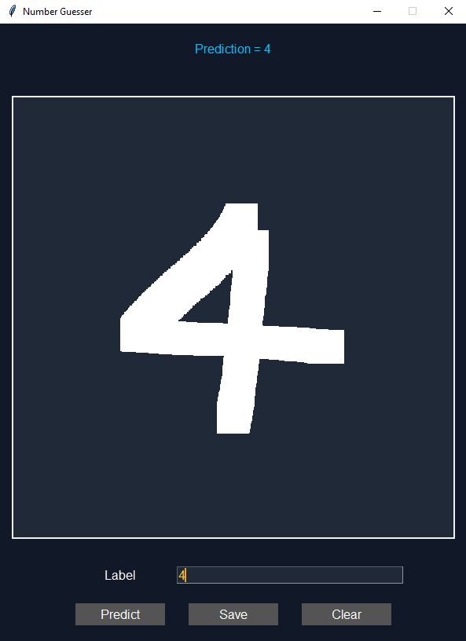

# Number Guesser AI

This program trains AI on MNIST digit data set. It allows the user to draw a number on the screen and have the AI take a guess of which digit it is. This uses a **basic neural network** model and Tensorflow.  

**Instruction:**  

1. <kbd>ESC</kbd> to quit the application
1. <kbd>left click</kbd> to draw a line in canvas
1. <kbd>right click</kbd> to erase a line in canvas
1. <kbd>predict button</kbd> to predict a drawn digit
1. <kbd>save button</kbd> to save a digit with label
1. <kbd>clear button</kbd> to clear both canvas and label name


**usage:**

```sh
>> py main.py
```

<p align="left">
    
</p>


## Resource

[tect with tim](https://github.com/techwithtim/Number-Guesser-Neural-Net)